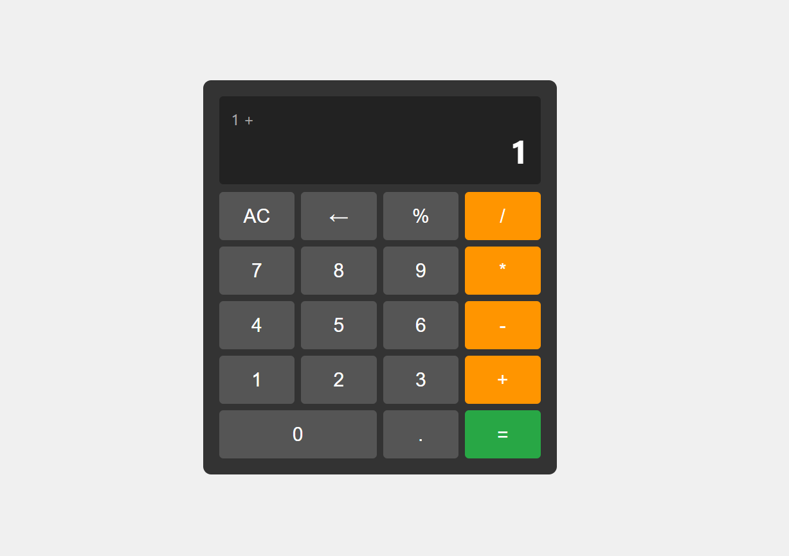

# Calculator



A sleek, responsive, and robust web calculator built with HTML, CSS, and JavaScript. This project focuses on delivering an intuitive user experience with accurate calculations and precise display formatting.

---

## ✨ Features

* **Standard Arithmetic Operations**: Perform addition, subtraction, multiplication, and division.
* **Chained Operations**: Seamlessly chain multiple operations (e.g., `5 + 3 * 2`) without needing to press equals (`=`) between each step.
* **Percentage Calculation**: Calculate percentages based on the current number or in relation to a pending operation (e.g., `100 + 10%`).
* **Decimal Support**: Work with floating-point numbers accurately.
* **Keyboard Input**: Full keyboard support for numbers, operators, decimal point, backspace, and enter.
* **Responsive Design**: A clean, modern UI that adapts to different screen sizes.
* **Advanced Number Display**:
    * **High Precision**: Handles floating-point inaccuracies (e.g., `0.1 + 0.2 = 0.3`).
    * **Dynamic Rounding**: Intelligently rounds numbers to fit within a 16-character display limit.
    * **Exponential Notation**: Automatically switches to scientific (exponential) notation (`e+`) for very large or very small numbers to ensure readability and fit the display.
    * **Clean Output**: Removes unnecessary trailing zeros for a polished look.
* **Robust Error Handling**:
    * Detects and displays "UNDEFINED" for division by zero, resetting the calculator to prevent further invalid operations.
    * Prevents incomplete operations from being executed.
* **Backspace Functionality**: Easily correct input by removing the last digit or operator.
* **Clear All**: Reset the calculator to its initial state.

---

## 🛠️ Technologies Used

* **HTML5**: For the structural markup of the calculator.
* **CSS3**: For styling, layout (Flexbox), and creating a modern, responsive user interface.
* **JavaScript (ES6+)**: For all the calculator's logic, DOM manipulation, and event handling.

---

## 🚀 Getting Started

To get a local copy up and running, follow these simple steps.

### Prerequisites

You only need a modern web browser (like Chrome, Firefox, Edge, Safari).

### Installation

1.  **Clone the repository:**
    ```bash
    git clone [https://github.com/matheusmarqs1/calculator](https://github.com/matheusmarqs1/calculator.git)
    ```
2.  **Navigate to the project directory:**
    ```bash
    cd calculator
    ```
3.  **Open `index.html`:**
    Simply open the `index.html` file in your preferred web browser.

---

## 💡 Usage

* Click the **number buttons** (0-9) to input digits.
* Click **operator buttons** (+, -, \*, /) to set the operation.
* Use the **decimal button** (.) for floating-point numbers.
* Press the **equals button** (=) to get the result.
* Use the **clear button** (AC or C) to reset the calculator.
* Use the **backspace button** (←) to delete the last digit or operator.
* Use the **percent button** (%) for percentage calculations.
* **Keyboard**: Use your keyboard's number keys, operators, Enter, Backspace, and Delete keys for interaction.

---

## 📞 Contact

Author - [Github profile](https://github.com/matheusmarqs1) 
